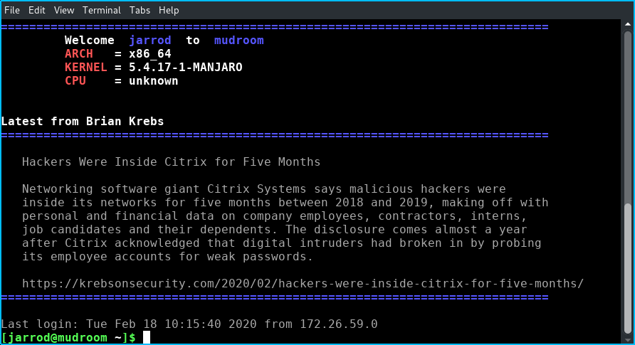

# Security Feeds

motd/motd_news.pam.sh is a simple message of the day shell script to demonstrate pulling alerts from an RSS feed.

Dependencies are highlighted in bold:
**curl** -s https://krebsonsecurity.com/feed/ | **xsltproc** /usr/local/share/rss_top.xsl - | **elinks** -dump -dump-color-mode 1

As you can see, I have installed the rss_top.xsl in /usr/local/share/.  I also installed the shell script in /usr/local/bin/.

The following line is added to /etc/pam.d/system-login (Arch Linux based system, might vary on different distros):
session    optional   pam_exec.so    stdout /usr/local/bin/motd_news.pam.sh

The result, when I log into the machine, the latest (first item listed) Brian Krebs is shown to me along with some useful system information:

The URL can be changed to whatever makes sense.  Note that if your source is JSON, the *jq* tool is an excellent way to process the output.
